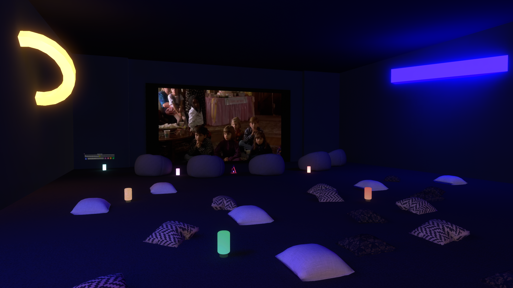

# 🦌 جمعتنا — Our Hangout | VRChat World

> A full Arabic social VR world with multiple mini-games, a cinema, arcade, music room, customizable spaces, and more — built entirely in VRChat.

**🔗 [Visit on VRChat](https://vrchat.com/home/world/wrld_ca213e03-1889-4c86-893b-331a5f45f8f5/info)**

*"With you our gathering is better"*

---

## 📖 About the World

**جمعتنا (Our Hangout)** is a comprehensive Arabic social VR world designed as a full hangout destination inside VRChat. It features multiple rooms, interactive mini-games, a cinema, an arcade, a music lounge, a customizable store, and a friend-finder system — all in one world.

---

## 🎮 Mini-Games

### 🏷️ خمن الشعار الصحيح — Guess the Real Logo
Spot the real logo versus the fake one. Points system tracks scores across rounds.

---

### 🕵️ أنت برا السالفة — You're Off Topic
A random topic appears for all players — one player secretly gets a different topic. Everyone asks questions to find out who is "off topic."

---

### 🎯 صراحة أو جراءة — Truth or Dare
Press the blue button for Truth, purple for Dare. Bilingual questions appear on the main screen.

---

### 🗣️ قول بس لا تقول — Say It But Don't Say It
A word challenge game where players describe a word without saying it directly.

---

## 🏠 World Features

### 🔄 Respawn System
Custom respawn system for players inside the world.

---

### 🎨 Customize Your World
Players can change the look and feel of the world to match their taste.

---

### 🛒 In-World Store
Browse and own floating items and accessories directly inside the world.

---

### 🎭 Character Floating Shapes
Players can change their floating shape/accessory from a variety of options.

---

### 🕹️ Arcade Room
Classic arcade machines playable inside VRChat.

---

### 🎬 Cinema Room
A cozy cinema where players watch videos together using a shared video player.

---

### 🎵 Music — Change the Song
A music system where players can change and stream music together.

---

## ✨ Features Summary

- 🎮 Multiple interactive mini-games (Truth or Dare, Off Topic, Logo Quiz, Say It But Don't Say It)
- 🎬 Shared cinema with video player
- 🎵 Music room with song switching
- 🛒 In-world store with floating items
- 🎨 World customization system
- 🔄 Custom respawn system
- 🌐 Fully bilingual Arabic & English UI
- 🦌 Custom Sanji Studio branding throughout

---

## 🛠️ Built With

- **Unity** — Full world environment & multi-room design
- **UdonSharp / Udon Graph** — All game logic, store system & customization
- **VRChat SDK** — Platform integration
- **Custom UI System** — Bilingual interactive menus

---

## 👨‍💻 Developer

**Faisal Alsharari** — [Sanji Studio](https://payhip.com/SanjiStudio)

- 🔗 [LinkedIn](https://www.linkedin.com/in/faisal-alsharari-161556366/)
- 🎮 [VRChat World](https://vrchat.com/home/world/wrld_ca213e03-1889-4c86-893b-331a5f45f8f5/info)
- 🛒 [Sanji Studio Store](https://payhip.com/SanjiStudio)
