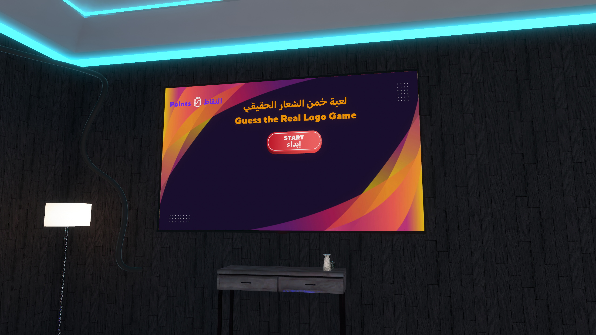
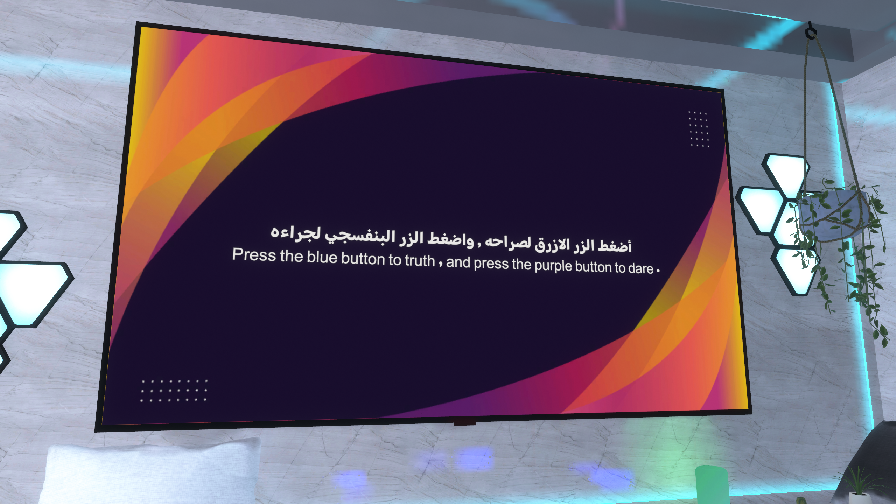

# 🦌 جمعتنا — Our Hangout | VRChat World

> A full Arabic social VR world with multiple mini-games, a cinema, arcade, music room, store system, and more — built entirely in VRChat.

**🔗 [Visit on VRChat](https://vrchat.com/home/world/wrld_ca213e03-1889-4c86-893b-331a5f45f8f5/info)**

*"With you our gathering is better"*

---

## 📖 About the World

**جمعتنا (Our Hangout)** is a comprehensive Arabic social VR world designed as a full hangout destination inside VRChat.  
It features multiple rooms, interactive mini-games, a cinema, an arcade, a music lounge, a store, and a friend-finder system — all in one world.

---

## 🎮 Mini-Games

### 🕵️ أنت برا السالفة — You're Off Topic
Players discuss a shared topic while one player secretly gets a different topic — everyone tries to identify who is "off topic."

---

### 🎯 صراحة أو جراءة — Truth or Dare
Interactive Truth or Dare with bilingual questions displayed on screen.

---

### 🏷️ خمن الشعار الحقيقي — Guess the Real Logo
Spot the difference between real and fake brand logos before time runs out.

---

### 🕹️ Arcade Room
Classic arcade machines playable inside VRChat — including Flappy Hat and other games.

---

## 🏠 World Spaces

### 🎬 Cinema Room
A cozy cinema room where players can watch videos together using a shared video player.

---

### 🎵 Music Lounge
A relaxing lounge with a record player and shared video stream where players can play music together.

---

### 🛒 Store System
An in-world store ("متجر جمعتنا") where players can browse and own floating items and VIP perks.

---

### 🚪 Portal Room — Choose Your Hangout
Players can teleport between multiple themed rooms via a portal selection system.

---

### 🔍 Find Your Friends
A built-in system to locate and show players within the world — with a "Hide me" option for privacy.

---

## ✨ Features

- 🎮 Multiple interactive mini-games (Truth or Dare, Off Topic, Logo Quiz, Arcade)
- 🎬 Shared cinema with video player
- 🎵 Music lounge with shared stream
- 🛒 In-world store with ownership system (Free & VIP items)
- 🚪 Multi-room portal teleportation system
- 🔍 Find Your Friends player locator
- 🌐 Fully bilingual Arabic & English UI
- 🦌 Custom Sanji Studio branding throughout

---

## 🛠️ Built With

- **Unity** — Full world environment & multi-room design
- **UdonSharp / Udon Graph** — All game logic, store system, portal system & player finder
- **VRChat SDK** — Platform integration
- **Custom UI System** — Bilingual interactive menus

---

## 👨‍💻 Developer

**Faisal Alsharari** — [Sanji Studio](https://payhip.com/SanjiStudio)

- 🔗 [LinkedIn](https://www.linkedin.com/in/faisal-alsharari-161556366/)
- 🎮 [VRChat World](https://vrchat.com/home/world/wrld_ca213e03-1889-4c86-893b-331a5f45f8f5/info)
- 🛒 [Sanji Studio Store](https://payhip.com/SanjiStudio)
